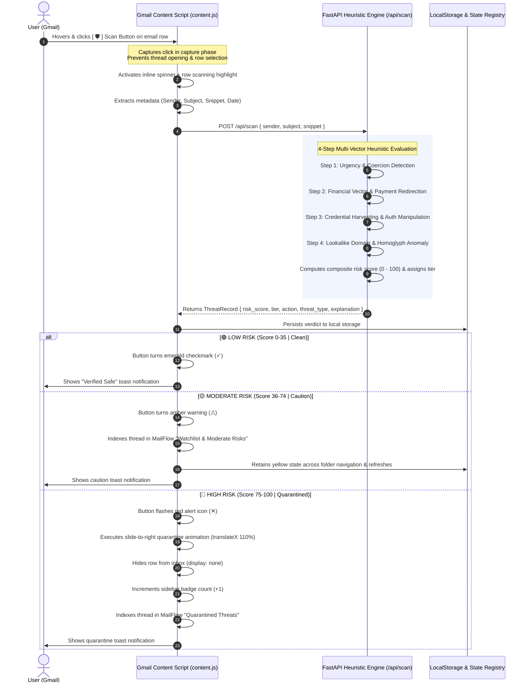

# MailFlow — SME Email Shield

> **Native Gmail Real-Time Threat Evaluation & Heuristic Defense Engine**  
> Protects small and medium-sized enterprises (SMEs) against business email compromise (BEC), invoice tampering, credential harvesting, and domain lookalike attacks directly inside Google Workspace.

---

## 🛡️ End-to-End Threat Detection Flow

MailFlow operates through a zero-latency, multi-step heuristic pipeline that coordinates between the Chrome extension content script and a local FastAPI heuristic engine.



---

### Step-by-Step Detection Pipeline Breakdown

```
                       ┌───────────────────────────────┐
                       │   Gmail Email Metadata Payload │
                       │    (Sender, Subject, Snippet) │
                       └──────────────┬────────────────┘
                                      │
                                      ▼
             ┌─────────────────────────────────────────────────┐
             │       Multi-Step Heuristic Detection Core       │
             └────────────────────────┬────────────────────────┘
                                      │
        ┌───────────────────┬─────────┴─────────┬───────────────────┐
        ▼                   ▼                   ▼                   ▼
┌──────────────┐    ┌──────────────┐    ┌──────────────┐    ┌──────────────┐
│    Step 1    │    │    Step 2    │    │    Step 3    │    │    Step 4    │
│  Urgency &   │    │  Financial   │    │  Credential  │    │  Lookalike   │
│   Coercion   │    │   Vectors    │    │  Harvesting  │    │   Domains    │
└───────┬──────┘    └───────┬──────┘    └───────┬──────┘    └───────┬──────┘
        │                   │                   │                   │
        └───────────────────┼───────────────────┴───────────────────┘
                            │
                            ▼
             ┌─────────────────────────────────┐
             │   Composite Risk Score (0-100)  │
             └──────────────┬──────────────────┘
                            │
         ┌──────────────────┼──────────────────┐
         ▼                  ▼                  ▼
  🟢 0 - 35 (Low)    🟡 36 - 74 (Moderate) 🔴 75 - 100 (High)
   Verified Safe       Watchlist Flagged    Quarantine Slide-Out
```

#### 1. Step 1: Urgency & Coercion Check (`backend/heuristics/urgency.py`)
- **Focus:** Detects psychological coercion, fear triggers, and artificial deadlines designed to bypass critical thinking.
- **Flagged Signals:**
  - High urgency calls-to-action (`"immediate action required"`, `"action required immediately"`).
  - Time-pressure countdowns (`"within 24 hours"`, `"deadline approaching"`, `"expires today"`).
  - Intimidation & account penalties (`"account suspended"`, `"access revoked"`, `"final notice"`, `"lawsuit"`).

#### 2. Step 2: Financial Vector & Payment Redirection (`backend/heuristics/financial.py`)
- **Focus:** Identifies Business Email Compromise (BEC), bank account hijacking, invoice fraud, and cryptocurrency demands.
- **Flagged Signals:**
  - Banking redirection (`"updated bank details"`, `"new IBAN"`, `"routing number"`, `"sort code"`).
  - Wire transfers and remittance tampering (`"wire transfer"`, `"direct deposit update"`, `"payment advice"`).
  - Untraceable extortion (`"gift cards"`, `"steam card"`, `"bitcoin"`, `"crypto wallet address"`).

#### 3. Step 3: Credential Harvesting & Auth Manipulation (`backend/heuristics/credentials.py`)
- **Focus:** Flags lures designed to steal corporate credentials, hijack MFA sessions, or compromise digital signatures.
- **Flagged Signals:**
  - Password reset traps (`"password reset request"`, `"password expired"`).
  - Fake identity verifications (`"verify credentials"`, `"re-authenticate session"`).
  - Breach lures & signature phishing (`"unusual sign-in activity"`, `"docusign document view"`, `"adobe sign"`).

#### 4. Step 4: Sender / Lookalike Anomaly Check (`backend/heuristics/lookalike.py`)
- **Focus:** Detects homoglyph typosquatting, generic multi-tier subdomains, and suspicious top-level domains (TLDs).
- **Flagged Signals:**
  - Brand typosquatting / homoglyphs (`paypa1`, `micros0ft`, `g00gle`, `amaz0n`, `netf1ix`).
  - Keyword-stuffed fake security domains (`*-security.*`, `*-verify.*`, `*-auth.*`, `*-support.*`).
  - High-risk TLDs (`.xyz`, `.top`, `.click`, `.work`, `.gq`, `.cf`).

---

## 🎨 Risk Tiers & Visual Reactions

| Risk Tier | Score Range | Shield Button State | Inbox Row Reaction | MailFlow Tab Placement |
| :--- | :---: | :---: | :--- | :--- |
| **🟢 Low Risk** | `0 – 35` | **Emerald Checkmark (`✓`)** | Stays in active inbox list | Not indexed |
| **🟡 Moderate Risk** | `36 – 74` | **Amber Warning (`⚠`)** | Retains yellow warning status across refreshes | **⚠️ Watchlist & Moderate Risks** |
| **🔴 High Risk** | `75 – 100` | **Red Alert (`✕`)** | **Smooth Slide-Right Animation** (`translateX 110%`) → Quarantined (`display: none`) | **🚨 Quarantined Threats** with `[ Restore to Inbox ]` |

---

## 📂 Project Architecture

```
MailFlow/
├── start_backend.sh          # Intelligent launcher (auto-activates venv, sets PYTHONPATH)
├── backend/                  # FastAPI Heuristic Analysis Engine
│   ├── main.py               # REST API endpoints (/api/scan, /api/threats, /api/ping)
│   ├── requirements.txt      # Dependencies (fastapi, uvicorn, pydantic)
│   └── heuristics/           # Modular Detection Modules
│       ├── __init__.py       # Module exports
│       ├── base.py           # Pydantic data models (StepResult, ThreatRecord, ScanPayload)
│       ├── urgency.py        # Step 1: Urgency & Coercion evaluation
│       ├── financial.py      # Step 2: Financial vector & BEC invoice detection
│       ├── credentials.py    # Step 3: Credential harvesting & auth manipulation
│       ├── lookalike.py      # Step 4: Typosquatting, homoglyphs & lookalike domains
│       └── pipeline.py       # Multi-vector scoring & plain-English SME explanation engine
└── extension/                # Chrome Extension Manifest V3
    ├── manifest.json         # Extension configuration & content script rules
    ├── popup.html            # Minimalist popup UI (Status, Settings, Theme toggle)
    ├── popup.css             # Popup design system
    ├── popup.js              # Live connection heartbeat & preferences
    ├── content.js            # Capture-phase DOM injections, state manager & MailFlow view
    ├── styles.css            # Pixel-perfect Material 3 Gmail DOM stylesheet
    └── icons/                # Extension badge icons (16x16, 48x48, 128x128)
```

---

## 🚀 Quickstart Guide

### 1. Start the Backend API Server

Run the start script from the repository root:

```bash
./start_backend.sh
```

- **API Host:** `http://127.0.0.1:8000`
- **Health Check:** `GET /api/ping`
- **Scan Endpoint:** `POST /api/scan`
- **Threat Registry:** `GET /api/threats`

---

### 2. Load the Chrome Extension

1. Open Google Chrome and visit `chrome://extensions/`.
2. Toggle on **Developer mode** in the top right corner.
3. Click **Load unpacked** and select the `/home/winters/MailFlow/extension` folder.
4. Pin the **MailFlow** shield icon to your browser toolbar.

---

### 3. Using MailFlow in Gmail

1. Open [Gmail](https://mail.google.com/).
2. Hover over any email row to reveal the native Gmail action toolbar.
3. Click the rightmost **[ 🛡️ ]** MailFlow Shield button:
   - **Visual Feedback:** The button transforms into an active spinner while the email row highlights.
   - **Verdict Applied:** The icon turns **Green (✓)**, **Yellow (⚠)**, or **Red (✕)** with an instant toast notification.
4. If a threat is high risk, it executes a slide-off animation and quarantines into the **MailFlow** sidebar tab.
5. Click the **MailFlow** tab in the sidebar:
   - View your quarantined threats and watchlist items in a sleek Gmail-native list.
   - Click any email row to **expand details** and review the exact threat breakdown.
   - Click **`[ ↩ Restore to Inbox ]`** to restore any quarantined email smoothly.
   - Click **`[ Clear All ]`** in the header to reset your threat registry at any time.

---

## 🔒 Privacy & SME Security

- **Zero Content Storage on Remote Servers:** All scanning is performed locally on your workstation (`localhost:8000`).
- **No Third-Party Tracking:** Email snippets and senders are never transmitted to external clouds.
- **Client-Side Persistence:** Threat state is stored securely in your browser's `localStorage`.
