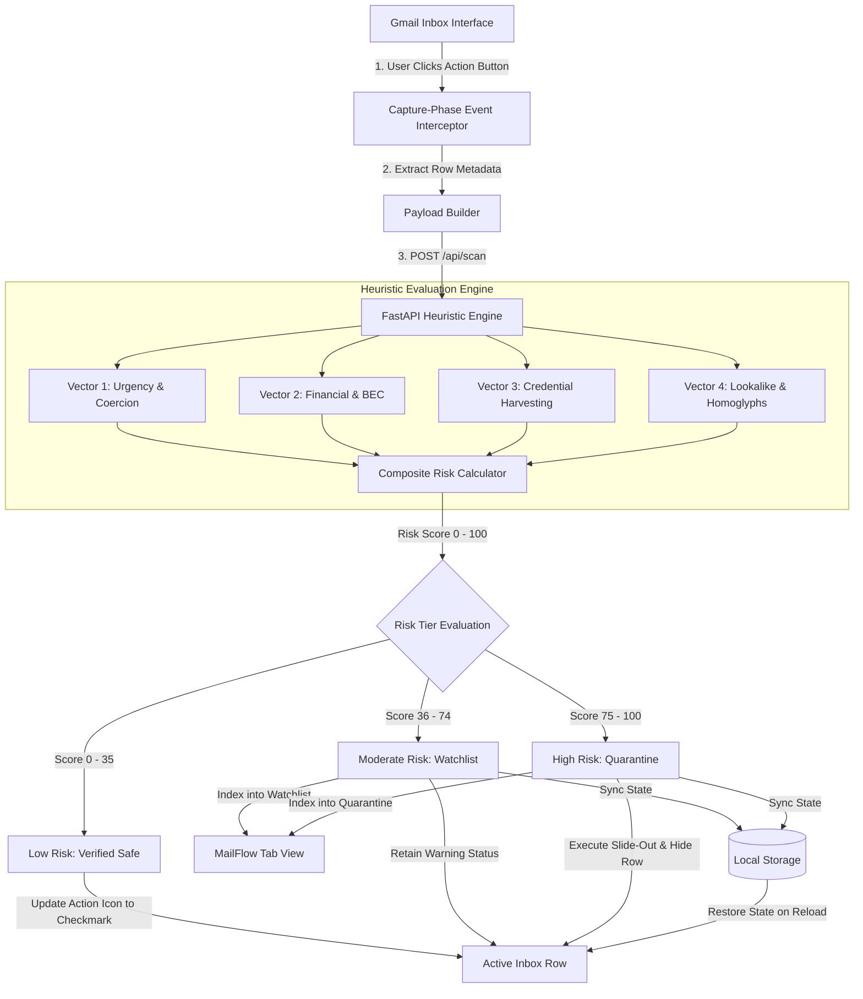
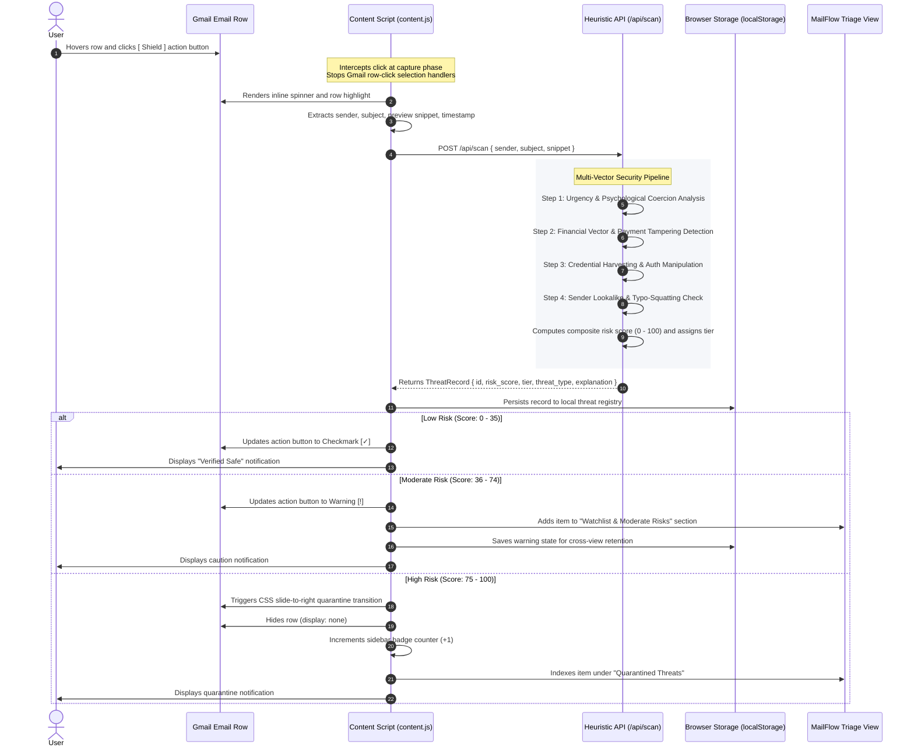
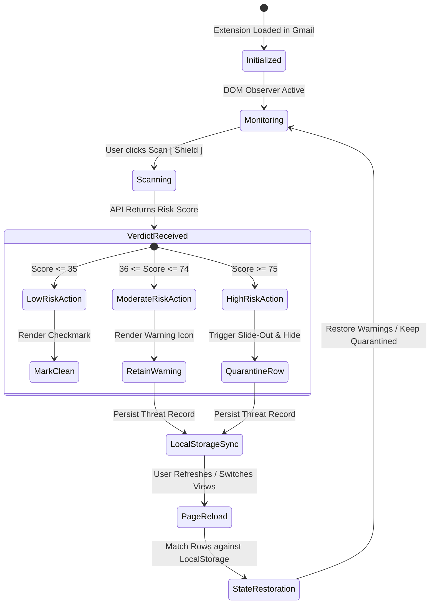

# MailFlow — SME Email Shield

> **Native Gmail Threat Detection & Heuristic Defense Engine**  
> Client-side browser extension and local heuristic analysis engine protecting organizations against Business Email Compromise (BEC), credential harvesting, invoice manipulation, and homoglyph domain attacks.

---

## System Architecture

MailFlow pairs a Google Chrome content script running inside the Gmail DOM with a local, low-latency FastAPI evaluation service.



---

## Threat Detection Flow & Lifecycle



---

## Technical Detection Logic

Each scanned email payload is evaluated against four distinct heuristic modules. Each module inspects the metadata for known social engineering signatures and assigns a vector score.

```
                  ┌─────────────────────────────────────────┐
                  │    Scanned Email Metadata Payload       │
                  │ (Sender Name, Email, Subject, Snippet)  │
                  └────────────────────┬────────────────────┘
                                       │
         ┌───────────────────┬─────────┴─────────┬───────────────────┐
         ▼                   ▼                   ▼                   ▼
 ┌───────────────┐   ┌───────────────┐   ┌───────────────┐   ┌───────────────┐
 │   Vector 1    │   │   Vector 2    │   │   Vector 3    │   │   Vector 4    │
 │   Urgency &   │   │  Financial &  │   │  Credential   │   │   Lookalike   │
 │   Coercion    │   │  Invoice BEC  │   │  Harvesting   │   │  & Homoglyphs │
 └───────┬───────┘   └───────┬───────┘   └───────┬───────┘   └───────┬───────┘
         │                   │                   │                   │
         └───────────────────┼───────────────────┴───────────────────┘
                             ▼
              ┌─────────────────────────────┐
              │ Composite Scoring Engine    │
              └──────────────┬──────────────┘
                             │
          ┌──────────────────┼──────────────────┐
          ▼                  ▼                  ▼
   [ Low: 0 - 35 ]   [ Moderate: 36 - 74 ] [ High: 75 - 100 ]
     Verified Safe     Watchlist Flagged     Quarantined Row
```

### 1. Urgency & Coercion Analysis (`backend/heuristics/urgency.py`)
* **Objective:** Identifies artificial urgency, fear appeals, and deadline intimidation designed to bypass verification workflows.
* **Evaluated Signals:**
  * Strict time countdowns (`"within 24 hours"`, `"immediate action required"`, `"expires today"`).
  * Account penalties and suspension intimidation (`"account suspended"`, `"access revoked"`, `"service termination"`).
  * Legal and executive pressure (`"final notice"`, `"compliance violation"`, `"strictly confidential"`).

### 2. Financial Vector & BEC Manipulation (`backend/heuristics/financial.py`)
* **Objective:** Detects invoice fraud, payment redirection, banking parameter tampering, and gift card/crypto extortion.
* **Evaluated Signals:**
  * Bank routing alterations (`"updated bank details"`, `"new account"`, `"new IBAN"`, `"sort code"`).
  * Wire transfer and invoice manipulation (`"wire transfer"`, `"invoice overdue"`, `"payment advice"`).
  * Untraceable payment requests (cryptocurrency wallet addresses, prepaid gift cards).

### 3. Credential Harvesting & Auth Manipulation (`backend/heuristics/credentials.py`)
* **Objective:** Detects deceptive authentication redirects, password reset traps, and signature lures.
* **Evaluated Signals:**
  * Password traps (`"password reset request"`, `"password expired"`, `"unlock account"`).
  * Session and 2FA verification lures (`"verify identity"`, `"re-authenticate"`, `"2fa update"`).
  * Document signature lures (fake DocuSign, Adobe Sign, or Google Docs review notifications).

### 4. Lookalike Domains & Homoglyph Anomalies (`backend/heuristics/lookalike.py`)
* **Objective:** Detects brand typosquatting, character substitution homoglyphs, and high-risk top-level domains.
* **Evaluated Signals:**
  * Brand typosquatting / homoglyphs (`paypa1`, `micros0ft`, `g00gle`, `amaz0n`, `netf1ix`).
  * Security-deceptive subdomains (`*-security.*`, `*-auth.*`, `*-verify.*`, `*-support.*`).
  * High-risk TLD patterns (`.xyz`, `.top`, `.click`, `.work`, `.gq`, `.cf`).

---

## Composite Scoring Model

The composite scoring engine determines the overall threat score by evaluating primary and secondary vector contributions:

$$\text{Composite Score} = \text{Primary Vector Score} + \left( \sum \text{Secondary Vector Scores} \times 0.35 \right)$$

$$\text{Final Score} = \min(\max(\text{round}(\text{Composite Score}), 0), 100)$$

| Risk Tier | Score Range | Default Action | Interface Treatment |
| :--- | :---: | :--- | :--- |
| **Low Risk** | `0 – 35` | Mark Safe | Green checkmark indicator; thread remains in inbox |
| **Moderate Risk** | `36 – 74` | Flag Watchlist | Amber warning indicator; state retained; indexed in MailFlow tab |
| **High Risk** | `75 – 100` | Quarantine | Red alert indicator; slide-out quarantine transition; isolated in MailFlow tab |

---

## Chrome Extension & State Lifecycle



### Key UI Features

* **Capture-Phase Interception:** Action button click handlers utilize `{ capture: true }` and `e.stopImmediatePropagation()` to intercept user clicks before Gmail's row-selection scripts navigate into email threads.
* **MailFlow Threat Center View:** Injected directly into Gmail's left navigation sidebar. Displays quarantined and watchlist emails in a clean native table layout matching Gmail's internal styling.
* **Accordion Detail Drawers:** Clicking any row in the MailFlow tab expands an inline drawer presenting the security evaluation, matched heuristic triggers, full metadata, and a `[ Restore to Inbox ]` action.
* **Cross-Session State Retention:** Stores verified and flagged threat records in browser `localStorage`, ensuring moderate risk warnings and quarantined items remain synced across folder changes and page reloads.

---

## Quickstart Guide

### 1. Start the Backend Service

Execute the startup script from the project root:

```bash
./start_backend.sh
```

* Backend Host: `http://127.0.0.1:8000`
* Health Endpoint: `GET /api/ping`
* Scan Endpoint: `POST /api/scan`
* Threat Registry: `GET /api/threats`

### 2. Load the Extension into Google Chrome

1. Navigate to `chrome://extensions/` in Chrome.
2. Toggle on **Developer mode** in the upper-right corner.
3. Click **Load unpacked** and select the `/home/winters/MailFlow/extension` directory.
4. Open [Gmail](https://mail.google.com/) and hover over any email row to evaluate incoming messages.
